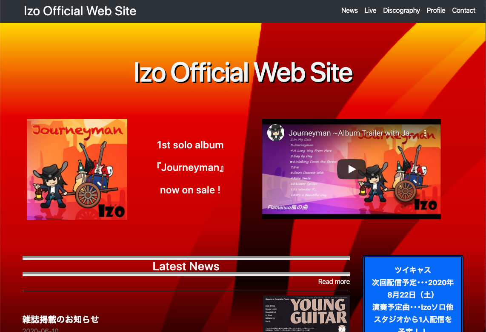

<h1>Izo Official Web Site</h1>
<h2>アプリケーションの概要</h2>
ギタリストIzoの活動を紹介するサイト
<a href="https://izo-guitar.com/" alt="URL">https://izo-guitar.com/</a>

<h2>アプリケーションの目的</h2>

プログラミングができないユーザーはWebサイトを作成してもらったとしても、自身で更新する事ができないため何かある度に更新を依頼しないといけません。

この課題を解決するために、自身で記事を更新できる仕組みを備えたWebサイトを開発しました。

<h2>アプリケーションの機能一覧</h2>
<ul>
  <li>ユーザー認証機能（Devise）</li>
  <li>投稿のCRUD機能</li>
  <li>複数画像投稿機能（ActiveStorage）</li>
  <li>ページネーション機能（Kaminari）</li>
  <li>レスポンシブWebデザイン</li>
  <li>お問い合わせフォーム</li>
</ul>
<h2>使用技術</h2>
<h3>環境</h3>
<ul>
  <li>Rails: 5.2.4.3</li>
  <li>Ruby: 2.5.1</li>
  <li>Postgresql: 12.3</li>
</ul>
<h3>デプロイ先</h3>
<ul>
  <li>heroku</li>
</ul>
<h3>その他の技術</h3>
<ul>
  <li>テスト（RSpec）</li>
  <li>リンター（Rubocop Airbnb）</li>
  <li>GitHub（GitHub Flowでの開発）</li>
  <li>Javascript / JQuery / Ajax</li>
  <li>Sendgridでのメールサービス</li>
  <li>独自ドメインでのSSL化</li>
</ul>
